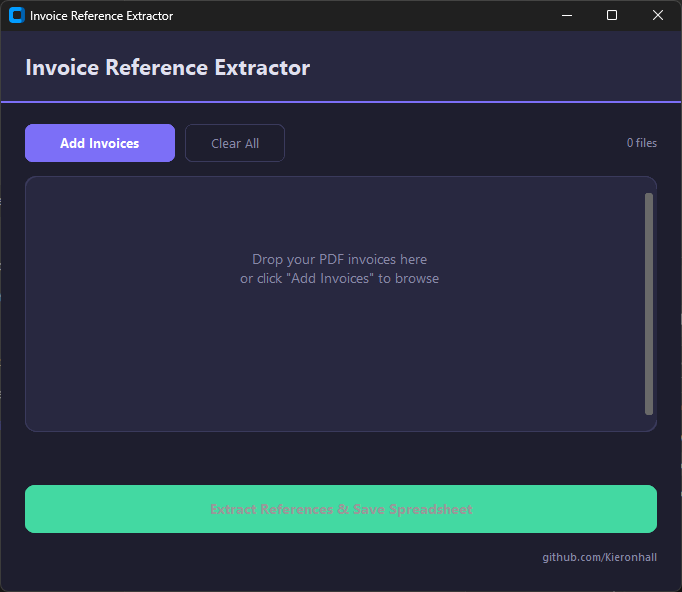

# Invoice Reference Extractor

A desktop tool I built to solve a real workflow problem — pulling JLR reference numbers out of invoice PDFs and dropping them into a clean, formatted Excel spreadsheet. Instead of manually opening each invoice and copying numbers one by one, you just load your PDFs and get a spreadsheet in seconds.


---

## What it does

- Reads invoice PDF files and extracts all JLR reference numbers (e.g. `JLR.01973402`)
- Strips the `JLR.` prefix so you're left with just the numeric IDs
- Automatically detects the supplier company name from the invoice
- Outputs a formatted `.xlsx` spreadsheet with one column per invoice, matching a professional template
- Includes a count row at the bottom of each column
- Preserves the order references appear in the document

## Why I built it

I was watching someone spend ages manually transcribing reference numbers from PDF invoices into spreadsheets. It was tedious, error-prone, and completely automatable. So I put this together as a quick tool they could actually use day-to-day without needing any technical knowledge — just double-click the `.exe` and go.

## How it works

The app uses **PyMuPDF** to parse each PDF page and extract the raw text. From there, regex patterns pick out the supplier name, invoice number, and all JLR reference codes. The references get deduplicated (they tend to appear twice in each invoice — once in the line item, once in a reference field) while keeping document order intact.

The spreadsheet generation uses **openpyxl** to build a properly styled Excel file with a title bar, column headers per invoice, and a `COUNTA` formula row for totals.

The UI is built with **CustomTkinter** for a clean dark-mode look that doesn't feel like a 2005 Windows app.

## Screenshot

<p align="center">
  
</p>

> *Add your own screenshot to `assets/screenshot.png`*

## Tech stack

| Component | Library |
|-----------|---------|
| PDF parsing | PyMuPDF (fitz) |
| Spreadsheet output | openpyxl |
| GUI | CustomTkinter |
| Packaging | PyInstaller |

## Running from source

```bash
pip install -r requirements.txt
python invoice_extractor.py
```

## Building the .exe

```bash
pip install pyinstaller
pyinstaller --onefile --windowed --name InvoiceExtractor invoice_extractor.py
```

The executable lands in `dist/InvoiceExtractor.exe`.

## Project structure

```
├── invoice_extractor.py    # All application logic (extraction + UI)
├── requirements.txt        # Python dependencies
├── assets/                 # Screenshots for README
└── README.md
```

## Notes

- The regex expects references in `JLR.XXXXXXXX` format (8 digits). If your invoices use a different pattern, tweak the regex in `extract_references_from_pdf()`.
- Invoice numbers are expected as 9-digit codes following the word "Invoice". Falls back to the filename if not found.
- Supplier detection reads the first "Company:" line under the "Supplier:" heading.

## License

MIT
